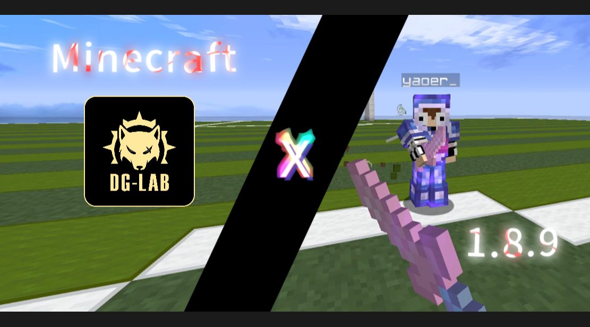

<h1 align="center">
  

    
  

    ElectricPVP
  

    
    
    
    
    
  

</h1>

ElectricPVP 是一个可以将 DG-LAB 郊狼3 接入 Minecraft 的客户端模组，为 Minecraft 1.8.9 Forge 打造。  
装上这个模组，体验更加真实的受击反馈！

**维护者**: Stars  
**许可证**: GPL v3 License | OSI Certified  
**Copyright © 2026 Starlight. Some Rights Reserved.**  

## 使用教程

1. **下载模组文件**  
   - 前往 [https://github.com/OpenStarlight/ElectricPVP/releases](https://github.com/OpenStarlight/ElectricPVP/releases) 下载最新模组文件

2. **安装模组及运行环境**
   - 安装 `Java 8`
   - 安装 `Minecraft 1.8.9`，模组加载器 `Forge`
   - 启动一次游戏后，将模组放入版本目录的 `mods` 文件夹下

3. **启动并进入游戏**
   - 启动游戏时如果出现 `OneConfig` 的加载界面，属于正常现象
   - 进入游戏后，按下 `RSHIFT` 即可打开配置界面，找到 `ElectricPVP`

4. **配置模组**
   - 根据你的喜好配置模组的各项设置
   - 可以配置强度设置和 HUD 设置

5. **连接至手机**
   - 确认 Websocket 服务器配置无误后，点击 `Show QR Code` 按钮，系统会自动打开二维码图片
   - 在 `DG-LAB APP` 中点击 `SOCKET 控制`，进入后扫描二维码即可连接
   > 如果无法连接至服务器，可能是因为电脑上有多个网络适配器，而自动识别的不是活跃的那个，此时可以点击 `Toggle Network Adapter` 更换网络适配器地址，聊天栏会显示适配器地址和名称，确认名称是你正在使用的网络适配器，然后重试

## 免责声明

**重要提示**: 本项目仅供学习和研究目的使用。使用者需对使用本软件所产生的任何后果承担**全部责任**。

- 本软件没有病毒
- 本软件涉及对现实设备操控，不当使用可能导致安全问题
- 本软件仅提供 Websocket 服务器连接接口以及基础功能实现，不保证配置安全性
- 本软件不保证可以完全安全运行，但已经过测试评估

> 软件的所有内容可以保证在完全符合配置要求的情况下完美运行，请确保您的系统配置符合要求。因该原因引发的所有问题，请勿上报给开发者。

安装并运行本软件，即代表您已**阅读并同意**以上以下内容：

- 您正在**了解相关风险**的情况下使用
- 您因使用本软件造成的任何损失，开发者**均不负责**
- 您遵守当地法律法规，合法使用本软件，不用于**恶意用途**
- 您理解本软件开发者仅为兴趣所做，本软件的最终解释权为**开发者所有**
- 您保证不对本软件及其开发者发表任何**侮辱性、污蔑性言论**
> 我们深知自己可能没有做到最好，并接受来自所有人的批评指正。请保留一份对开发者的尊重。

## 特别感谢

### AI辅助开发
- **Deepseek**
- **ChatGPT**

### 引用
- [DG_LAB mod](https://github.com/CaiJi-ikun/DG_LAB)
- [OneConfig](https://github.com/Polyfrost/OneConfig)

### 开发环境
- **IntellJ IDEA** - 强大的集成开发环境
- **Java** - 高效跨平台支持

## Star History

<a href="https://www.star-history.com/?repos=OpenStarlight%2FElectricPVP&type=date&legend=top-left">
 <picture>
   <source media="(prefers-color-scheme: dark)" srcset="https://api.star-history.com/chart?repos=OpenStarlight/ElectricPVP&type=date&theme=dark&legend=top-left" />
   <source media="(prefers-color-scheme: light)" srcset="https://api.star-history.com/chart?repos=OpenStarlight/ElectricPVP&type=date&legend=top-left" />
   
 </picture>
</a>

**给我们点亮小星星，这对我们很重要！**  
